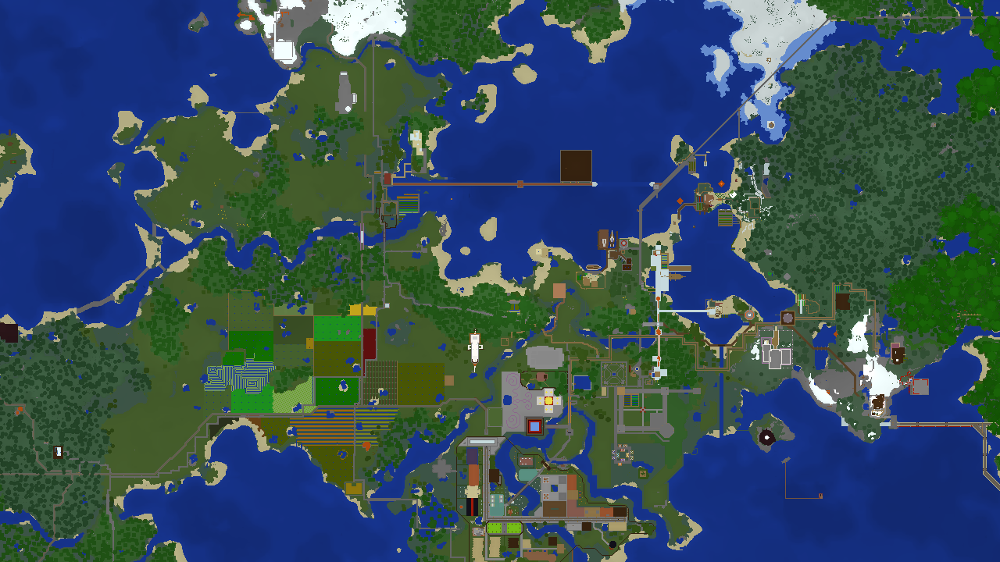

# MinedMap

* Render beautiful maps of your [Minecraft](https://minecraft.net/) worlds!
* Put them on a webserver and view them in your browser!
* Compatible with unmodified Minecraft Java Edition 1.8 up to 1.20 (no mod installation necessary!)
* Illumination layer: the world at night
* Fast: create a full map for a huge 3GB savegame in less than 5 minutes in single-threaded operation
* Multi-threading support: pass `-j N` to the renderer to use `N` parallel threads for generation
* Incremental updates: only recreate map tiles for regions that have changed
* Typically uses less than 100MB of RAM in single-threaded operation (may be higher when `-j` is passed)
* Cross-platform: runs on Linux, Windows, and likely other systems like MacOS as well



## How to use

MinedMap consists of two components: a map renderer generating map tiles from
Minecraft save games, and a viewer for displaying and navigating maps in a browser
based on [Leaflet](https://leafletjs.com/). The map renderer is heavily inspired by
[MapRend](https://github.com/YSelfTool/MapRend), but it has been implemented in C++
from scratch for highest performance.

The viewer expects the the map data in a directory named `data`. To generate a new
map, create this empty directory inside the viewer directory. Next, to generate the
map files run MinedMap passing the source and the destination paths on the command
line:
```shell
minedmap /path/to/save/game /path/to/viewer/data
```
The save game is stored in `saves` inside your Minecraft main directory
(`~/.minecraft` on Linux, `C:\Users\<username>\AppData\Roaming\.minecraft` on Windows)
in a subdirectory with the name of your world.

The first map generation might take a while for big worlds, but subsequent calls will
only rebuild tiles for region files that have changed, rarely taking more than a second
or two. This makes it feasible to update the map very frequently, e.g. by running
MinedMap as a Cron job every minute.

Note that it is not possible to open the viewer *index.html* without a webserver, as
it cannot load the generated map information from `file://` URIs. For testing purposes,
you can use a minimal HTTP server, e.g. (if you have Python installed):
```shell
python3 -m http.server
```
This test server is very slow and cannot handle multiple requests concurrently, so use
a proper webserver like [nginx](https://nginx.org/) or upload the viewer together with
the generated map files to public webspace to make the map available to others.

## Installation

Building the MinedMap map generator requires a recent Rust toolchain. There are no
releases on crates.io or binary releases yet. For now, it can be installed using the
following command:
```shell
cargo install --git 'https://github.com/NeoRaider/MinedMap.git'
```

In addition, CMake is needed to build the zlib-ng library. If you do not have
CMake installed, you can disable the zlib-ng feature by passing `--no-default-features`
to cargo. A pure-Rust zlib implementation will be used, which is more portable,
but slower than zlib-ng.

If you are looking for the older C++ implementation of the MinedMap tile renderer,
see the (v1.19.1)[https://github.com/NeoRaider/MinedMap/tree/v1.19.1] tag.

